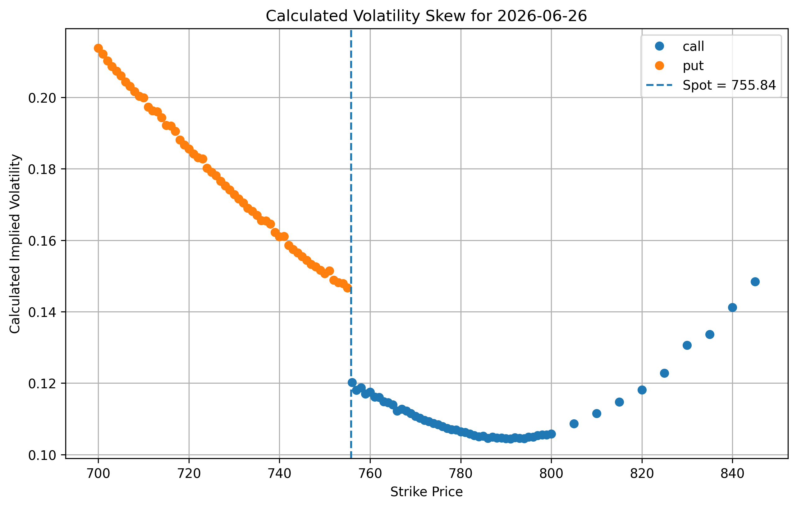
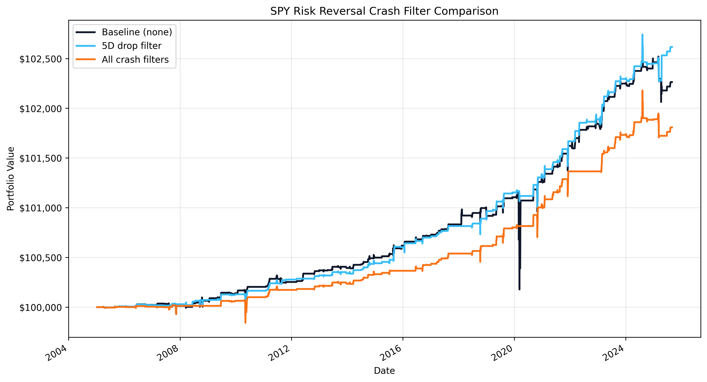

# SPY Volatility Skew Monitor

A Python-based options analytics project that builds a live SPY volatility skew, solves for implied volatility using Newton-Raphson, constructs delta-hedged risk reversal trades, and includes a prototype historical backtest using contract-level OptionMetrics or locally downloaded options data.

## Overview

This project analyzes the volatility skew in SPY options. In the Black-Scholes model, volatility is assumed to be constant across strikes, but real options markets often show a skew: out-of-the-money puts usually trade at higher implied volatility than out-of-the-money calls because investors pay a premium for downside protection.

The project pulls live SPY options chain data, calculates implied volatility across strikes, visualizes the volatility skew, and constructs a delta-hedged risk reversal trade by selling rich downside volatility, buying upside convexity, and hedging net option delta with SPY shares.

The project also includes a historical backtest engine that uses contract-level option history to test Z-score entry and exit rules for the risk reversal strategy.

## Key Features

* Pulls live SPY options chain data using `yfinance`
* Filters for out-of-the-money puts and calls
* Uses bid/ask midpoint as the observed market option price
* Implements Black-Scholes call and put pricing
* Calculates option Greeks including delta, gamma, and Vega
* Solves for implied volatility using Newton-Raphson iteration
* Uses rolling realized volatility as the initial IV guess
* Builds and plots the implied volatility skew across strikes
* Calculates downside skew and risk reversal skew
* Constructs a delta-hedged risk reversal:

  * Sell OTM put
  * Buy OTM call
  * Hedge net delta with SPY shares
* Includes a historical backtest using OptionMetrics-style data or downloaded contract-level options bars
* Supports command-line backtest settings for dates, capital, contracts, moneyness, DTE, and crash protection
* Saves backtest outputs including equity curve, trade log, and skew history
* Prints summary metrics including total return, Sharpe ratio, max drawdown, trade count, win rate, average PnL, and best/worst trade

## Project Structure

```text
spy-volatility-skew-monitor/
│
├── src/
│   ├── black_scholes.py          # Black-Scholes call and put pricing
│   ├── greeks.py                 # Delta, gamma, and Vega calculations
│   ├── implied_vol.py            # Newton-Raphson implied volatility solver
│   ├── price_data.py             # Historical SPY price data and log returns
│   ├── realized_vol.py           # Rolling realized volatility estimator
│   ├── skew_strategy.py          # Skew metrics, signals, and hedge sizing
│   ├── vol_surface.py            # Live volatility skew builder and plotter
│   ├── backtest.py               # OptionMetrics and local CSV historical skew strategy backtest
│   └── main.py                   # Main live project entry point
│
├── assets/
│   ├── live_vol_skew_sample.png
│   └── backtest_equity_curve.png
│
├── README.md
├── requirements.txt
└── .gitignore
```

## Methodology

### 1. Market Price from Bid/Ask Midpoint

For each live option, the market price is estimated using the midpoint between the bid and ask:

```python
market_price = (bid + ask) / 2
```

This midpoint is treated as the observed market option price. The midpoint is used instead of `lastPrice` because options often trade less frequently than stocks, making the last traded price potentially stale.

### 2. Black-Scholes Theoretical Price

The project uses Black-Scholes to calculate the theoretical value of European call and put options.

The implied volatility solver repeatedly compares:

```text
Black-Scholes theoretical price - Market midpoint price
```

The goal is to find the volatility input that makes the theoretical option price match the observed market price.

### 3. Newton-Raphson Implied Volatility Solver

Implied volatility is solved using Newton-Raphson:

```text
sigma_next = sigma - (theoretical_price - market_price) / Vega
```

Vega is used because it measures how much the option price changes with respect to volatility. The solver uses recent rolling realized volatility as the initial guess, which gives the iteration a realistic starting point.

### 4. Volatility Skew Construction

The project filters the options chain to focus on out-of-the-money options:

```text
OTM puts: strike < spot price
OTM calls: strike > spot price
```

It then calculates implied volatility for each contract and plots implied volatility against strike price.

### 5. Delta-Hedged Risk Reversal

The strategy module constructs a risk reversal when downside skew appears rich:

```text
Sell OTM put
Buy OTM call
Delta hedge with SPY shares
```

The hedge is calculated using option deltas:

```text
Hedge Shares = -Net Option Delta × 100 × Number of Contracts
```

A negative hedge share value means the strategy shorts SPY shares. A positive hedge share value means the strategy buys SPY shares.

## Installation

Create and activate a virtual environment:

```bash
python3 -m venv .venv
source .venv/bin/activate
```

Install dependencies:

```bash
pip install -r requirements.txt
```

## Usage

Run the full live skew monitor and trade constructor:

```bash
python src/main.py
```

This script will:

1. Pull live SPY options data
2. Select an expiration date
3. Filter for liquid OTM puts and calls
4. Calculate implied volatility across strikes
5. Save the skew data to CSV
6. Calculate risk reversal skew
7. Construct a delta-hedged risk reversal trade
8. Plot the volatility skew

Run the historical backtest using the default OptionMetrics sibling data folder:

```bash
python src/backtest.py
```

By default, the backtest reads from:

```text
../SPY_optionmetrics_data/
```

The default crash protection setting is `--crash-filter 5d-drop`. You can choose a different entry filter from the command line:

```bash
python src/backtest.py --crash-filter none
python src/backtest.py --crash-filter 5d-drop
python src/backtest.py --crash-filter all
```

You can also set the date window and capital base:

```bash
python src/backtest.py --start-date 2005-01-01 --end-date 2019-12-31 --initial-capital 25000
```

Generate one graph comparing the baseline and both crash-protection modes:

```bash
python src/backtest.py --compare-crash-filters --equity-plot assets/backtest_equity_curve.png
```

The starting capital does not need to be `$100,000`; it is the denominator for portfolio value and total return. Sharpe ratio is calculated from the daily portfolio returns.

## Example Live Output

The trade constructor returns information such as:

```text
Trade
Expiry
Spot
Contracts
Sell_Put_Strike
Sell_Put_IV
Sell_Put_Mid
Sell_Put_Delta
Buy_Call_Strike
Buy_Call_IV
Buy_Call_Mid
Buy_Call_Delta
Risk_Reversal_Skew
Net_Option_Delta
Net_Share_Delta
Hedge_Shares
Net_Premium_Per_Share
Net_Premium_Total
```

## Sample Live Volatility Skew

The live monitor calculates implied volatility across current SPY option strikes and plots the resulting volatility skew. The example below shows the typical equity-index smirk shape, where out-of-the-money puts trade at higher implied volatility than out-of-the-money calls due to demand for downside protection.



The visible transition around spot reflects the construction method: the live skew uses OTM puts below spot and OTM calls above spot. Because live option-chain data can include bid/ask midpoint noise, stale quotes, dividend effects, and simplified Black-Scholes assumptions, the plot is intended as a practical skew monitor rather than a fully smoothed arbitrage-free volatility surface.

## Historical Backtest

The project includes a prototype historical backtest using contract-level daily option history. The default path expects OptionMetrics-style SPY files in a sibling data folder:

```text
../SPY_optionmetrics_data/options_prices.csv.gz
../SPY_optionmetrics_data/security_prices.csv.gz
```

The legacy local CSV format can still be used with `--data-source legacy` and files under `data/raw/options/`. Raw historical market data is not included in this repository.

The backtest constructs a SPY risk reversal by selling an OTM put, buying an OTM call, and delta hedging with SPY shares at trade entry.

The backtest uses:

```text
Risk Reversal Skew = OTM Put IV - OTM Call IV
```

A rolling Z-score is calculated on this skew spread. The strategy enters when skew is unusually steep and exits when skew normalizes or when a maximum holding period is reached.

### Backtest Logic

```text
Entry:
- Skew Z-score > entry threshold
- Crash filter is inactive
- Sell selected OTM put
- Buy selected OTM call
- Delta hedge with SPY shares

Exit:
- Skew Z-score falls below exit threshold
- Or maximum holding period is reached
```

### Crash Protection

Crash protection is an entry guardrail. It blocks new trades during stressed market regimes, but it does not force an existing trade to close. Open positions still exit only when skew normalizes or the maximum holding period is reached.

Available settings:

* `--crash-filter 5d-drop`: default; blocks entries when SPY's trailing 5-trading-day return is below `-3%`
* `--crash-filter all`: evaluates all three guards and blocks entries when the 5-day drop filter, below-200-day-moving-average filter, or high-realized-volatility filter is active
* `--crash-filter none`: disables crash protection

The thresholds can be tuned with `--crash-filter-drop-window`, `--crash-filter-drop-threshold`, `--crash-filter-ma-window`, `--crash-filter-rv-window`, and `--crash-filter-rv-quantile`.

## Backtest Results

Reported comparison configuration:

| Setting | Value |
| --- | --- |
| Date range | 2005-01-10 to 2025-08-29 |
| Data source | OptionMetrics IvyDB via WRDS |
| Ticker | SPY |
| Starting capital | `$100,000` |
| Contracts | `1` risk reversal |
| Entry Z | `2.0` |
| Exit Z | `0.5` |
| Maximum holding period | `10` trading observations |
| Put moneyness | `0.90` |
| Call moneyness | `1.10` |
| Target DTE | `45` |
| Min/max DTE | `21` / `75` |
| Execution mode | Midpoint |
| Signal timing | Signal from day `t` close; execution on next available trading day |
| Daily NAV | Midpoint mark-to-market of open options plus static SPY hedge PnL |
| Historical hedge delta | Black-Scholes delta at entry |
| Hedge behavior | Static from entry to exit |
| Transaction costs | Not modeled; entries, exits, and daily marks use midpoint prices |

Crash-filter definitions:

* `none`: no crash filter
* `5d-drop`: blocks new entries when SPY's trailing 5-trading-day return is below `-3%`
* `all`: blocks new entries when the 5-day drop filter, below-200-day-moving-average filter, or high-realized-volatility filter is active

The backtest generates signals using day `t` close data and executes on the next available trading day. In the reported historical run, option entries, exits, and daily marks use midpoint prices. Sharpe ratio is annualized from daily marked-to-market portfolio returns.

| Strategy | Final Value | Total Return | Sharpe | Max Drawdown | Trades | Win Rate | Average PnL | Best Trade | Worst Trade |
| --- | ---: | ---: | ---: | ---: | ---: | ---: | ---: | ---: | ---: |
| Baseline, no crash filter | `$102,263.13` | `2.26%` | `0.38` | `-0.97%` | `126` | `74.60%` | `$17.96` | `$499.38` | `$-546.07` |
| Default `5d-drop` filter | `$102,616.18` | `2.62%` | `0.76` | `-0.46%` | `116` | `75.86%` | `$22.55` | `$246.19` | `$-166.21` |
| Combined `all` filters | `$101,807.54` | `1.81%` | `0.59` | `-0.46%` | `92` | `73.91%` | `$19.65` | `$176.40` | `$-166.21` |

These corrected results use daily marked-to-market NAV, signal-on-`t` / execution-on-`t+1` timing, pending entry and exit handling, delayed exits when held-contract quotes are unavailable, end-of-sample forced close, midpoint historical execution, and a static Black-Scholes entry hedge. The results should be interpreted as a corrected baseline, not an optimized strategy.

### Backtest Equity Curve

The backtest equity chart can be generated as a single-strategy curve or as a comparison view. The comparison view shows the baseline with no crash protection, the default `5d-drop` filter, and the combined `all` filter.



## Important Note on Trade Execution

This project does not execute live trades through a brokerage API. It constructs and analyzes the trade, including the option legs and required delta hedge. The output is intended for research, learning, and options strategy analysis.

## Limitations

This project includes a prototype historical backtest, but it is not a complete institutional-grade options strategy backtest.

Current limitations include:

* Historical backtest uses daily option records rather than intraday quote history
* Raw OptionMetrics/WRDS market data is not distributed in this repository
* Results depend on local OptionMetrics data quality and selected backtest parameters
* Crash filters are simple price and volatility rules, not complete tail-risk hedges
* Historical execution is midpoint-only; bid/ask spread, commissions, exchange fees, borrow costs, and market impact are not modeled
* Margin and capital requirements for the short put are not modeled
* Delta hedge is sized at trade entry and is not dynamically rebalanced
* Assignment, early exercise, and dividend-specific option pricing effects are not explicitly modeled
* Parameter choices have not been walk-forward validated
* The current research scope is a single-underlying SPY prototype
* Results should be interpreted as a research prototype rather than a proven alpha strategy

## Future Improvements

Potential extensions include:

* Run broader parameter sweeps across entry Z-score, exit Z-score, holding period, and strike moneyness
* Compare `none`, `5d-drop`, and `all` crash protection across multiple date windows
* Explore ways to increase profitability while preserving high win-rate and risk-controlled behavior
* Add bid/ask execution and max-spread entry eligibility filters
* Compare Black-Scholes hedge sizing with OptionMetrics vendor delta hedging
* Add explicit commissions, fees, slippage, market impact, and margin/funding assumptions
* Add dynamic delta hedging and daily hedge rebalancing logic
* Compare hedged versus unhedged risk reversal performance
* Estimate max drawdown and worst-trade loss with and without delta hedging
* Expand testing across multiple expirations and larger strike grids
* Add term structure analysis across expirations
* Add interpolation or smoothing across strikes
* Build a dashboard for live skew monitoring and backtest results

## Technologies Used

* Python
* NumPy
* pandas
* SciPy
* matplotlib
* yfinance

## Author

Christopher Munroe
University of Michigan
Mathematics of Finance and Risk Management
[LinkedIn](https://www.linkedin.com/in/chrismunroe12)
